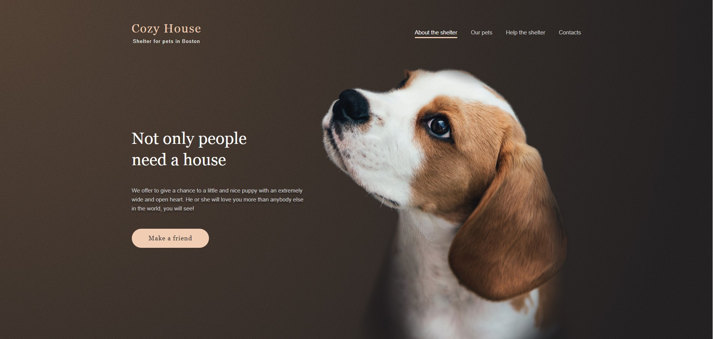
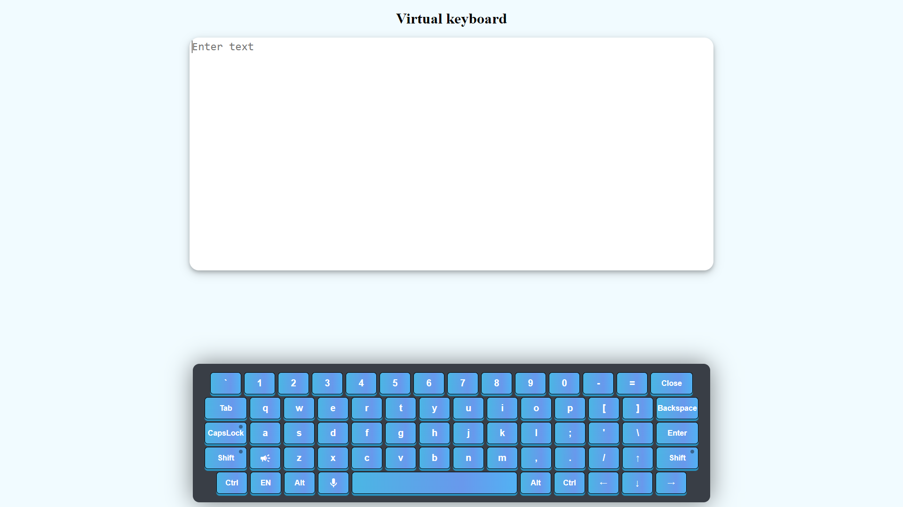

### Hi there 👋 Here are some of my study apps 

English for kids  | Gem Puzzle (canvas) | Shelter
:--: | :--:  | :--:
   |  | 
[Repo](https://github.com/LiliyaSm/RS-School-2020/tree/master/english-for-kids) | [Repo](https://github.com/LiliyaSm/RS-School-2020/tree/master/gem-puzzle) | [Repo](https://github.com/LiliyaSm/RS-School-2020/tree/master/shelter)
[Deploy](https://rolling-scopes-school.github.io/liliyasm-JS2020Q3/english-for-kids/) | [Deploy](https://rolling-scopes-school.github.io/liliyasm-JS2020Q3/gem-puzzle/)  | [Deploy](https://rolling-scopes-school.github.io/liliyasm-JS2020Q3/shelter/pages/main/main.html)
Application for children for learning English words written in pure JS | Classic barley-break game written using Canvas  | Responsive site using design from Figma

Covid Dashboard   | Game "Balda"    | Virtual keyboard
:--: | :--:  | :--:  
   |  | 
[Repo](https://github.com/LiliyaSm/covid-dashboard/tree/develop) | [Repo](https://github.com/LiliyaSm/rsclone/tree/develop) | [Repo](https://github.com/LiliyaSm/RS-School-2020/tree/master/virtual-keyboard)
[Deploy](https://liliyasm-covid-dashboard.netlify.app/) | [Deploy](https://rsclone-balda.netlify.app/) |[Deploy](https://rolling-scopes-school.github.io/liliyasm-JS2020Q3/virtual-keyboard/)
An application to track the spread of COVID-19 in the world and in individual countries. Information is presented in the form of a table, list, graph and interactive map. | A team task where we developed the game Balda | Virtual keyboard with speech recognition

