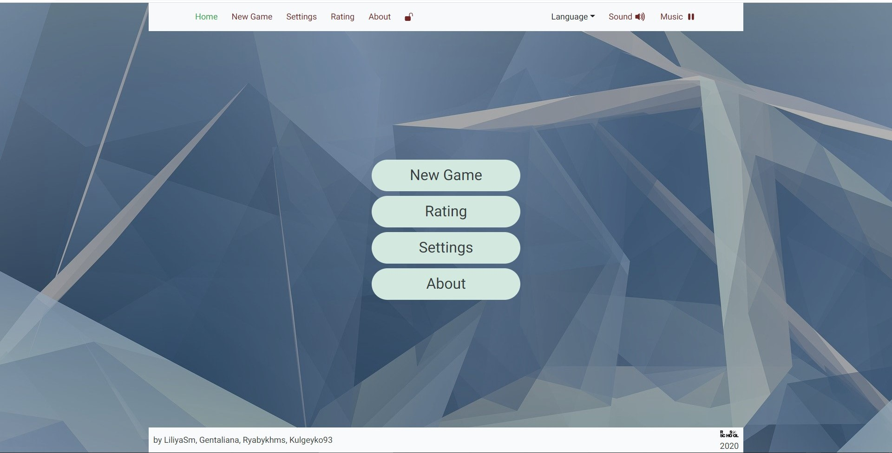

### Hi there 👋

Covid Dashboard   | Game "Balda"   
:--: | :--:  
   | 
[Repo](https://github.com/) | [Repo](https://github.com/) 
[Deploy](https://liliyasm-covid-dashboard.netlify.app/) | [Deploy](https://rsclone-balda.netlify.app/) 
[Task](https://github.com/rolling-scopes-school/tasks/blob/master/tasks/covid-dashboard.md) | [Task](https://github.com/rolling-scopes-school/tasks/blob/master/tasks/rsclone/rsclone.md) 

English for kids  | Gem Puzzle (canvas)
:--: | :--:  
   | 
[Repo](https://github.com/) | [Repo](https://github.com/) 
[Deploy](https://rolling-scopes-school.github.io/liliyasm-JS2020Q3/english-for-kids/) | [Deploy](https://rolling-scopes-school.github.io/liliyasm-JS2020Q3/gem-puzzle/) 
[Task](https://github.com/rolling-scopes-school/tasks/blob/master/tasks/rslang/english-for-kids.md) | [Task](https://github.com/rolling-scopes-school/tasks/blob/master/tasks/gem-pazzle/codejam-the-gem-puzzle.md) 
